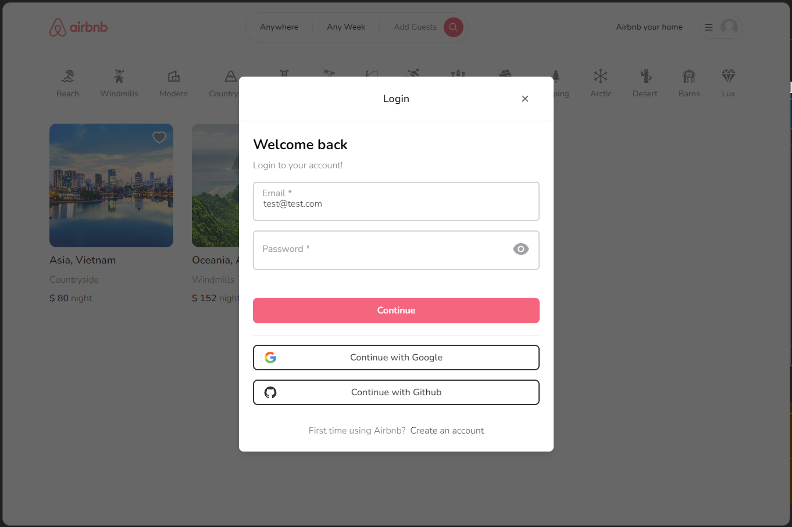

# Airbnb Clone

https://airbnbclone.tinspham.dev/

## Tech-stack
- Next.JS 13
- TypeScript
- TailwindCSS
- Zustand
- React-hook-form
- Prisma
- MongoDB
- Next/auth

# Screenshot



## Installation

1. setup `.env` file
   - create new file `.env` same with `.env.example`, input correct key
2. run project
```
npm install

npm run dev
```